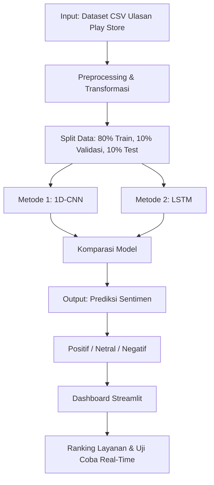

# IGAR (Indonesian Government Applications Review) Classification Comparable Deep Learning

&gt; Analisis sentimen ulasan layanan publik Indonesia menggunakan Deep Learning berbasis CNN dan LSTM.

---

## Live Demo

[🔗 https://igar-kelompok11.streamlit.app]([https://igar-kelompok11.streamlit.app](https://igar-deeplearning-uaskelompok11.streamlit.app/))

---

## Latar Belakang

Aplikasi layanan publik pemerintah Indonesia seringkali menerima ulasan beragam dari pengguna di Google Play Store. Namun, volume ulasan yang besar membuat evaluasi manual tidak efisien. IGAR hadir sebagai solusi otomatisasi analisis sentimen menggunakan Deep Learning untuk membantu stakeholder memahami kepuasan pengguna secara real-time.

---

## Dataset

| Atribut | Keterangan |
|---------|-----------|
| **Sumber** | Google Play Store |
| **Aplikasi** | 6 layanan publik Indonesia |
| **Total Ulasan** | ~50.000 review |
| **Labeling** | VADER Sentiment Analysis (otomatis) |
| **Kolom Teks** | `content` |
| **Kolom Aplikasi** | `app` |

### Daftar Aplikasi
| No | Aplikasi | Kategori |
|:--:|:---------|:---------|
| 1 | Mobile JKN | Kesehatan |
| 2 | MyPertamina | Energi |
| 3 | KAI Access | Transportasi |
| 4 | SATUSEHAT | Kesehatan |
| 5 | JMO | Jaminan Sosial |
| 6 | BMKG Info | Cuaca & Bencana |

---


## 🏗️ Arsitektur Sistem


---

## Preprocessing Pipeline

| Tahap | Proses | Output |
|:------|:-------|:-------|
| **Text Cleaning** | Lowercase, remove URL, remove mention (`@user`), remove special characters | Teks bersih |
| **Tokenization** | Konversi teks ke sequence of integers | Sequence numerik |
| **Padding** | Samakan panjang sequence (MAX_LENGTH = 50) | Padded sequences |
| **Label Encoding** | Map label ke integer (0=Negatif, 1=Netral, 2=Positif) | Integer labels |

---

## Model Deep Learning

### 1. 1D-CNN (Convolutional Neural Network)
Input (50) → Embedding → Conv1D(128, kernel=3,4,5) → GlobalMaxPooling
→ Dropout(0.5) → Dense(64, ReLU) → Dense(3, Softmax)


| Hyperparameter | Nilai |
|:-------------|:------|
| Filter Size | 128, 64, 32 |
| Kernel Size | 3, 4, 5 |
| Pooling | Global Max Pooling |
| Dropout | 0.5 |
| Optimizer | Adam |
| Loss | Categorical Crossentropy |

### 2. LSTM (Long Short-Term Memory)
Input (50) → Embedding → LSTM(128) → Dropout(0.2)
→ Dense(64, ReLU) → Dense(3, Softmax)


| Hyperparameter | Nilai |
|:-------------|:------|
| LSTM Units | 128 |
| Dense Units | 64 |
| Recurrent Dropout | 0.2 |
| Return Sequences | False |

---

## Hasil Evaluasi

### Perbandingan Metrik

| Metrik | 1D-CNN (Terbaik) | LSTM | Selisih |
|:-------|:----------------:|:----:|:-------:|
| **Akurasi** | **0.8520** | 0.8360 | +1.60% |
| **Presisi** | **0.8567** | 0.8382 | +1.85% |
| **Recall** | **0.8520** | 0.8360 | +1.60% |
| **F1-Score** | **0.8528** | 0.8360 | +1.68% |

### Confusion Matrix

| Model | Negatif Recall | Netral Recall | Positif Recall |
|:------|:--------------:|:-------------:|:--------------:|
| **1D-CNN** | 87.3% | 85.0% | 95.9% |
| **LSTM** | 83.6% | 83.3% | 95.2% |

### Kesimpulan

> **1D-CNN dipilih sebagai model terbaik** karena secara konsisten mengungguli LSTM di semua metrik. CNN lebih efektif menangkap fitur lokal (n-gram) pada teks ulasan yang relatif pendek, sementara LSTM cenderung overfit pada dataset dengan variasi bahasa informal yang tinggi.

---

## Fitur Aplikasi

| Tab | Fungsi |
|:----|:-------|
| **Eksplorasi Data** | Cuplikan dataset, distribusi sentimen keseluruhan & per aplikasi |
| **Komparasi Model** | Tabel metrik, radar chart, confusion matrix, detail arsitektur |
| **Ranking Layanan** | Peringkat aplikasi berdasarkan sentiment score (0-100) |
| **Uji Coba & Prediksi** | Input teks ulasan real-time, prediksi sentimen dengan probabilitas |

---

## Struktur Repository
IGAR-DeepLearning/
├── .streamlit/
│ └── config.toml # Konfigurasi tema & layout Streamlit
├── app/
│ ├── app.py # Entry point aplikasi Streamlit
│ ├── utils.py # Fungsi preprocessing & prediksi
│ └── components.py # Komponen UI (glass cards, tabel)
├── models/
│ ├── model_cnn_terbaik.h5 # Model CNN terbaik (15.7 MB)
│ ├── tokenizer.pickle # Tokenizer hasil training
│ └── encoder.pickle # Label encoder
├── data/
│ └── VADER_labeled.csv # Dataset (110 MB) – tidak diupload ke GitHub
├── notebooks/
│ ├── 01_data_preprocessing.ipynb
│ ├── 02_vader_labeling.ipynb
│ ├── 03_model_cnn.ipynb
│ ├── 04_model_lstm.ipynb
│ └── 05_evaluation.ipynb
├── requirements.txt # Dependencies Python
├── .gitignore # File yang diabaikan Git
└── README.md # Dokumentasi ini
 
---

## Cara Menjalankan

### Local

```bash
# Clone repository
git clone https://github.com/username/IGAR-DeepLearning.git
cd IGAR-DeepLearning

# Install dependencies
pip install -r requirements.txt

# Jalankan aplikasi
streamlit run app/app.py
Buka browser di http://localhost:8501

Streamlit Cloud
Push ke GitHub
Buka share.streamlit.io
Connect repository → pilih app/app.py
Deploy
```
---

##Teknologi
Kategori: Stack
Framework: Streamlit
DeepLearning: TensorFlow / Keras
Visualisasi: Plotly
DataProcessing: Pandas, NumPy
Font: Playfair Display, Inter

##Tim Pengembang
Kelompok 11 — Sistem Informasi
Tahun Akademik 2025/2026
1. Azza Almira Lalitya
2. Farhan Zuso Putra Jaya
